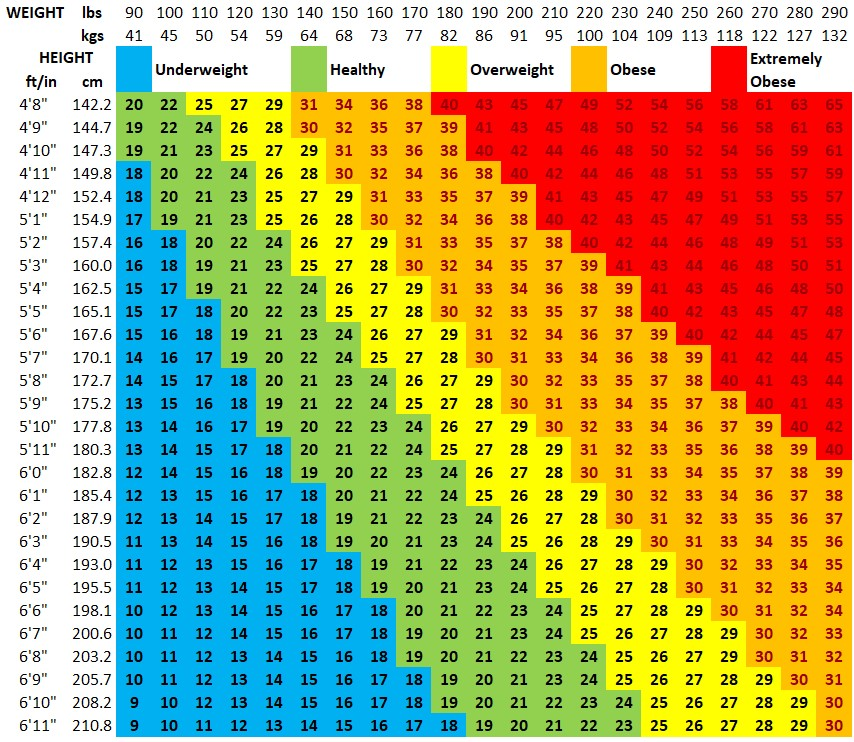

# BMI (Body Mass Index)

Body Mass Index (BMI) is a measure of body fat based on height and weight. It is used to categorize individuals into weight status categories that may indicate health risks.



## Functions

### evaluateBMI(heightInMetersOrInches, weightInKgOrLbs, isMetric)

Calculates the BMI value from height and weight measurements.

**Metric Formula:**
```
BMI = weight (kg) / (height (m))²
```

**Imperial Formula:**
```
BMI = (weight (lb) × 703) / (height (in))²
```

**Parameters:**
- `heightInMetersOrInches`: Height in meters (metric) or inches (imperial)
- `weightInKgOrLbs`: Weight in kilograms (metric) or pounds (imperial)
- `isMetric`: Boolean indicating whether metric units are used

**Returns:** BMI value as a decimal number

---

### evaluateStatus(bmi)

Determines the weight status category based on the BMI value.

| BMI Range | Status |
|-----------|--------|
| < 18.5 | `underweight` |
| 18.5 - 24.9 | `normal` |
| 25.0 - 29.9 | `overweight` |
| 30.0 - 34.9 | `class1.obesity` |
| 35.0 - 39.9 | `class2.obesity` |
| >= 40.0 | `class3.obesity` |

**Parameters:**
- `bmi`: The calculated BMI value

**Returns:** Status string indicating the weight category

---

### evaluateScore(bmi)

Calculates a health score from 0 (worst) to 1000 (best) based on the BMI value.

#### Scoring Ranges

| BMI Range | Category | Score Range | Notes |
|-----------|----------|-------------|-------|
| < 18.5 | Underweight | 849 → 0 | Gentler slope; less severe than overweight |
| 18.5 - 21.9 | Normal (below ideal) | 850 → 1000 | Score increases toward ideal BMI of 22 |
| 22.0 - 24.9 | Normal (at/above ideal) | 1000 → 850 | Score decreases from ideal BMI of 22 |
| 25.0 - 29.9 | Overweight | 849 → 700 | Linear decrease |
| 30.0 - 34.9 | Class 1 Obesity | 699 → 600 | Linear decrease |
| 35.0 - 39.9 | Class 2 Obesity | 599 → 500 | Linear decrease |
| >= 40.0 | Class 3 Obesity | 499 → 0 | Linear decrease toward zero |

#### Scoring Philosophy

- **Ideal BMI (22)**: A BMI of 22 is considered optimal and receives the maximum score of 1000.
- **Normal Range**: Scores decrease symmetrically as BMI moves away from 22, reaching 850 at both boundaries (18.5 and 25).
- **Underweight**: While being underweight carries health risks, it is considered less severe than being overweight. The scoring uses a gentler slope (50 points per BMI unit) compared to the overweight categories.
- **Overweight/Obesity**: Scores decrease progressively through each obesity class, reflecting increasing health risks associated with higher BMI values.

#### Scoring Formulas

**Underweight (BMI < 18.5):**
```
score = max(0, round(849 - (18.5 - bmi) × 50))
```

**Normal - Below Ideal (18.5 ≤ BMI < 22):**
```
score = round(850 + (bmi - 18.5) × (150 / 3.5))
```

**Normal - At/Above Ideal (22 ≤ BMI < 25):**
```
score = round(1000 - (bmi - 22) × (150 / 3))
```

**Overweight (25 ≤ BMI < 30):**
```
score = round(849 - (bmi - 25) × (149 / 5))
```

**Class 1 Obesity (30 ≤ BMI < 35):**
```
score = round(699 - (bmi - 30) × (99 / 5))
```

**Class 2 Obesity (35 ≤ BMI < 40):**
```
score = round(599 - (bmi - 35) × (99 / 5))
```

**Class 3 Obesity (BMI ≥ 40):**
```
score = max(0, round(499 - (bmi - 40) × 24.95))
```

**Parameters:**
- `bmi`: The calculated BMI value

**Returns:** Integer score from 0 to 1000

---

## Sources

- **BMI Categories**: [CDC - BMI Categories for Adults 20 and Older](https://www.cdc.gov/bmi/adult-calculator/bmi-categories.html)
- **BMI Chart**: [BMI Calculator - BMI Chart](https://bmicalculator.mes.fm/bmi-chart)
