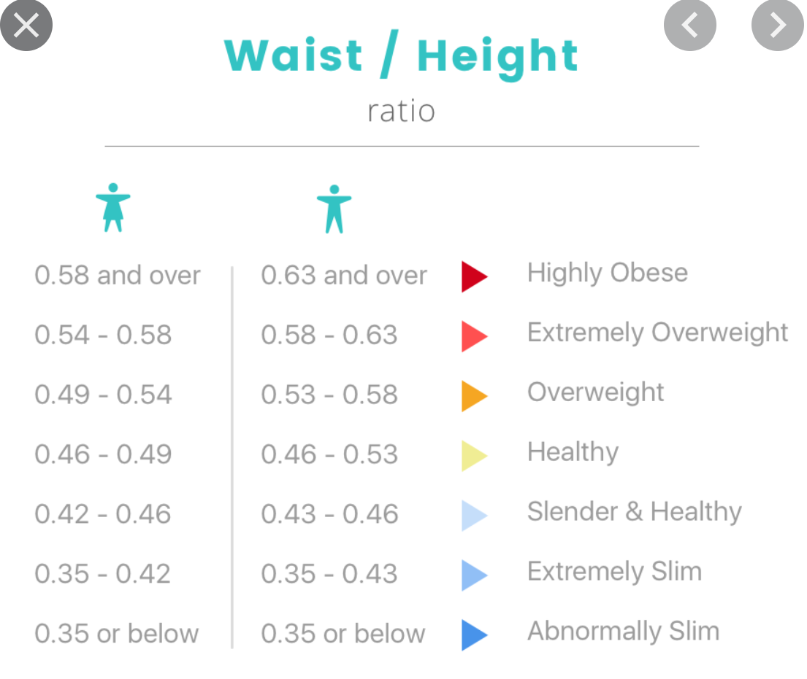

# Waist-to-Height Ratio (WHtR)

## Overview

The Waist-to-Height Ratio (WHtR) is a simple and effective measure of body fat distribution and overall health risk. It is calculated by dividing the waist circumference by the height:

```
WHtR = Waist Circumference / Height
```

**Important:** Both measurements must use the same units (e.g., both in centimeters or both in inches). The ratio is unitless.

## Why Waist-to-Height Ratio?

WHtR is considered a reliable indicator of:
- Central obesity (abdominal fat distribution)
- Cardiovascular disease risk
- Insulin sensitivity/resistance
- Metabolic health

The rationale for using WHtR as a metric for overall health and as an indicator of insulin sensitivity/resistance is explained in [this video](https://www.youtube.com/watch?v=Snj8UMkdiY4&t=77s) at the 1:17 time marker.

## Reference Chart



*Chart source: [Waist to Height Ratio Calculator](https://calculator.academy/waist-to-height-ratio-calculator-whtr-calculator/)*

## Status Categories

### Men

| WHtR Range | Status |
|------------|--------|
| < 0.35 | Abnormally Slim |
| 0.35 - 0.42 | Extremely Slim |
| 0.42 - 0.46 | Slender & Healthy |
| 0.46 - 0.49 | Healthy |
| 0.49 - 0.54 | Overweight |
| 0.54 - 0.58 | Extremely Overweight |
| >= 0.58 | Highly Obese |

### Women

| WHtR Range | Status |
|------------|--------|
| < 0.35 | Abnormally Slim |
| 0.35 - 0.43 | Extremely Slim |
| 0.43 - 0.46 | Slender & Healthy |
| 0.46 - 0.53 | Healthy |
| 0.53 - 0.58 | Overweight |
| 0.58 - 0.63 | Extremely Overweight |
| >= 0.63 | Highly Obese |

## Health Scoring (0-1000)

The scoring system assigns a health score from 0 (worst) to 1000 (best) based on the WHtR value.

### Scoring Logic

| Category | Score Range | Description |
|----------|-------------|-------------|
| Abnormally Slim | 749 -> 0 | Score starts at 749 at the boundary (0.35) and decreases as WHtR goes lower. Being too slim is penalized less severely than being overweight. |
| Extremely Slim | 750 -> 899 | Score increases from 750 at lower boundary to 899 approaching the upper boundary. |
| Slender & Healthy | 900 -> 1000 | Score increases from 900 at lower boundary to 1000 (perfect) at upper boundary. |
| Healthy | 1000 -> 801 | Score starts at 1000 (perfect) at lower boundary and decreases to 801 approaching upper boundary. |
| Overweight | 800 -> 650 | Score starts at 800 at lower boundary and decreases to 650 approaching upper boundary. |
| Extremely Overweight | 649 -> 500 | Score starts at 649 at lower boundary and decreases to 500 approaching upper boundary. |
| Highly Obese | 499 -> 0 | Score starts at 499 at lower boundary and approaches 0 as WHtR increases. |

### Score Interpretation

- **900-1000**: Excellent - Optimal body composition
- **750-899**: Good - Healthy but not optimal
- **650-799**: Moderate - Some health risk
- **500-649**: Poor - Elevated health risk
- **0-499**: Very Poor - High health risk

## Implementation Details

The `evaluateStatus` function determines the category based on WHtR and sex.

The `evaluateScore` function calculates a numeric score using linear interpolation within each category range. The formulas ensure smooth transitions between categories while reflecting the relative health impact of each range.

## References

- [Waist to Height Ratio Calculator (WHtR Calculator)](https://calculator.academy/waist-to-height-ratio-calculator-whtr-calculator/)
- [You will know your Insulin Resistance is REVERSED when THIS HAPPENS](https://www.youtube.com/watch?v=Snj8UMkdiY4&t=77s)
